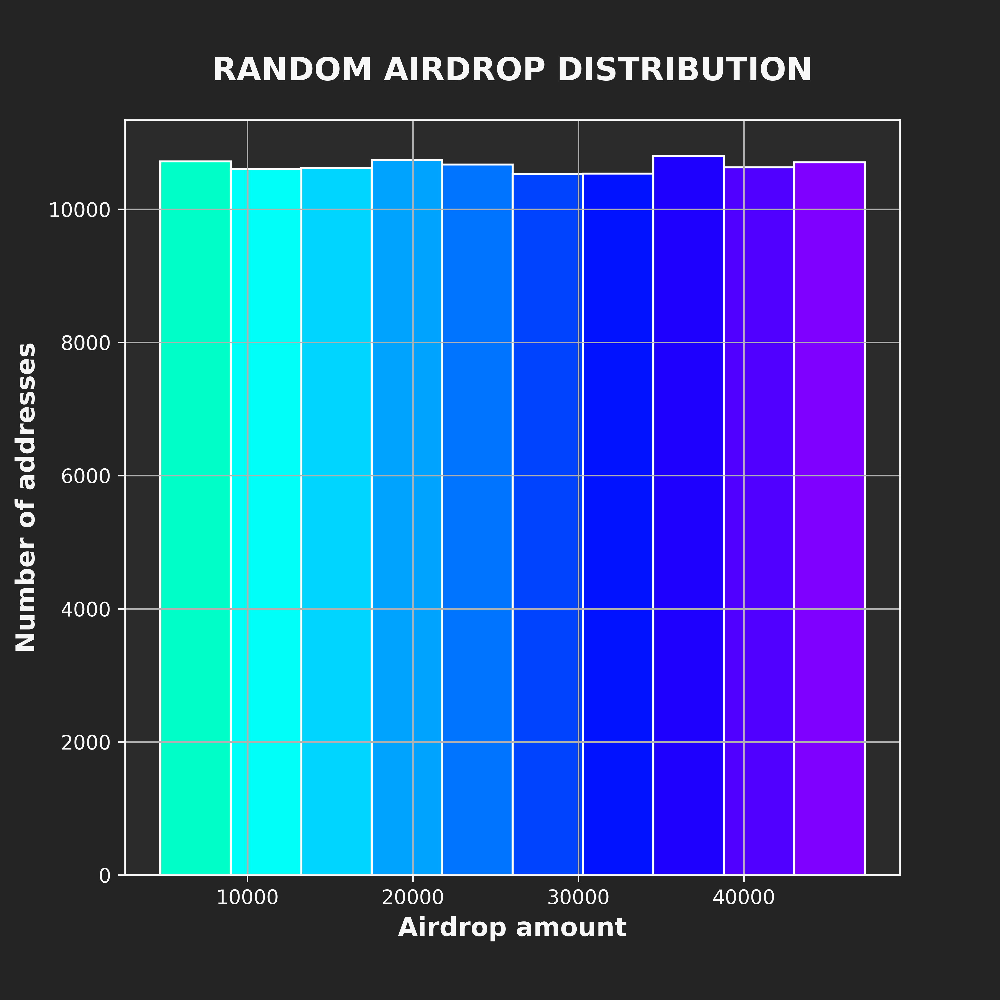

# Airdrop Helper

This repo contains scripts helpful in creating the airdrop for the Comos Arcade token.

## Distribution

Each eligible wallet will receive an airdrop according to a uniform distribution. The fatter wallets does not stand a better chance of receiving a higher airdorp.

<p align="center">

</p>

## Content

- `assets`: contains the images generated from the main script.

- `functions`: contains some helper functions.

- `output`: contains the output of the main scripts, i.e., the files used for the airdrop.

- `snapshots`: contains the snapshots used for computing the airdrop. Right now just two toy snapshots are included.

- `config.json`: is the configuration file for the main script.

- `simulation.ipynb`: this is a Jupyter Notebook for easy visualization.

## Virtualenv

Install the dependencies contained in the `requirements.txt` file:

```python
pip3 install requirements.txt
```


